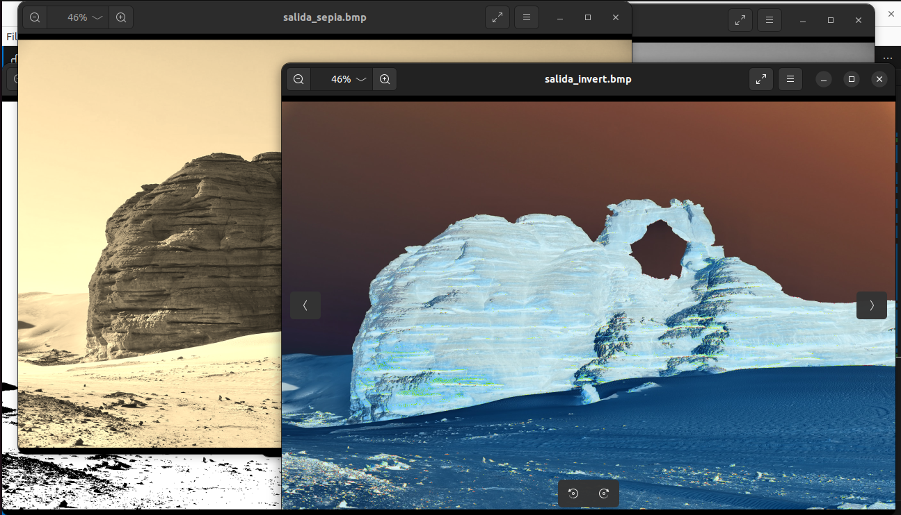

# README - Filtros para imágenes BMP
Este proyecto aplica un filtros a imágenes BMP utilizando una combinación de código en C++ y ensamblador (ASM). Es una herramienta básica que demuestra el manejo de archivos de imagen BMP y cómo realizar operaciones de procesamiento de imágenes.
## Objetivo de la tarea
De los principales objetivos de esta tarea es aplicar los conocimientos aprendidos sobre los registros sse y avx para aprovechar las instrucciones de empaquetamiento de datos que ofrecen estos registros. Además, aplicar optimizaciones en el código para mejorar el rendimiento. En este caso se buscaban 5 optimizaciones:
* Guardar direcciones de memoria en registros sse para no tener que pasar accediendo a memoria.
* Optimizar las secciones de los ciclos de código que se repiten muchas veces.

### Requisitos:
* Compilador C++: g++ (compatible con C++17 o superior).
* Ensamblador: nasm., en caso de no tenerlo:
                                 sudo apt update
                                 sudo apt install nasm            
* Sistema operativo: Linux o cualquier sistema compatible con herramientas GNU.
* Dependiendo del sistema puede ser necesario instalar los paquetes para ver por    pantalla las imágenes generadas: ** sudo apt update **
                                 ** sudo apt install xdg-utils **
* En caso de que xdg-utils no funciones, puede ser necesario instalar eog:
                                 ** sudo apt update **
                                 ** sudo apt install eog **


Estructura del proyecto:
Carpeta `entradas/`: Contiene las imagenes a procesar
Carpeta `salidas/`: Se guarda la imagen con 4 filtros aplicados (sepia, escala de grises, negativo y binarizado)

### Estructura del proyecto:

```plaintext
.
├── entradas/           # Carpeta con las imagenes de entrada
│   ├── entrada1.bmp    # Imagen BMP de prueba.
│   ├── entrada2.bmp    # Imagen BMP de prueba.
│   ├── entrada3.bmp    # Imagen BMP de prueba.
│   └── entrada4.bmp    # Imagen BMP de prueba.
├── salidas/            # Carpeta de salida con los cuatro filtros aplicados.
├── build/              # Carpeta para archivos objeto (.o).
├── bin/                # Carpeta para el ejecutable final.
├── main.cpp            # Código principal en C++.
├── sepia_filter.asm    # Código ensamblador para filtro sepia.
├── grayscale_filter.asm   # Código ensamblador para filtro escala de grises.
├── invert_filter.asm   # Código ensamblador para filtro negativo
├── binarize_filter.asm   # Código ensamblador para filtro binarizador
├── Makefile            # Script para compilar y ejecutar el proyecto.
└── README.md           # Este archivo (Manual de uso).
```

### **Compilación y ejecución**
1. **Preparación**
Asegúrese de tener los archivos BMP válidos la carpeta `entradas/`.
2. **Compilación**
Para compilar el proyecto, utiliza el siguiente comando en el terminal:

```bash
make clean
make
```
Esto generará el ejecutable en la carpeta `bin/`. Los archivos `.o` se generarán en la carpeta `build/`.

3. **Ejecución**
Para aplicar los 4 filstros a la imagen especificada:

```bash
./bin/filtros <nombre_imagen.bmp>
```

Al hacer esto, el programa buscará la imagen BMP respectiva en la carpeta `entradas/`. Cargará la imagen y aplicará los cuatro filtros. Luego guardará las nuevas imagenes con los cuatros filtros aplicados en la carpeta `salidas/`. Finalmente, se abrirán automáticamente las imagenes creadas para que el usuario pueda visualizarlas directamente.

#### Ejemplo de uso
Suponga que se quiere usar una de las imagenes de prueba incluidas, por ejemplo `entrada1.bmp`. Tras haber compilado el programa puede ejecutarlo de la siguiente forma para aplicar los filtros a esta imagen respectiva.

```bash
./bin/filtros entrada1.bmp

```

La salida del programa debería verse algo así:

```plaintext
jerson@jerson-IdeaPad-3-15ITL05:~/Desktop/Ensambla/TP2$ ./bin/filtros entrada1.bmp
Cargando archivo: entradas/entrada1.bmp
Imagen cargada con dimensiones: 1920x1280
Aplicando filtro sepia...
Filtro sepia guardado en salida_sepia.bmp
Aplicando filtro escala de grises...
Filtro escala de grises guardado en salida_grayscale.bmp
Aplicando filtro de inversión...
Filtro de inversión guardado en salida_invert.bmp
Aplicando filtro binarizador...
Filtro binarizador guardado en salida_binarize.bmp

```

También se mostrarán en pantalla las imagenes creadas, algo semejante a como se muestra a continuación:



### Notas importantes
* **Formato de imagen:** Este programa solo funciona con imágenes en formato BMP. Si utilizas otros formatos (como PNG o JPG), deberás convertirlos previamente.
* **Límites:** La implementación asume imágenes BMP con un encabezado de 54 bytes y 24 bits de color. Otros formatos BMP podrían no ser compatibles.
* **Manejo de errores:** El programa genera mensajes de error claros en pantalla si no se encontró el archivo, no pudo abrise, no pudieron aplicarse los filtros, no pudieron crearse las nuevas imagenes o abrise, entre otros.

# Referencias
Las imágenes de prueba fueron obtenidas de los siguientes enlaces:
* entrada1.bmp: https://filesampleshub.com/format/image/bmp
* entrada2.bmp: https://samples-files.com/sample-bmp-file/
* entrada3.bmp: https://filesamples.com/formats/bmp
* entrada4.bmp: https://people.math.sc.edu/Burkardt/data/bmp/bmp.html
