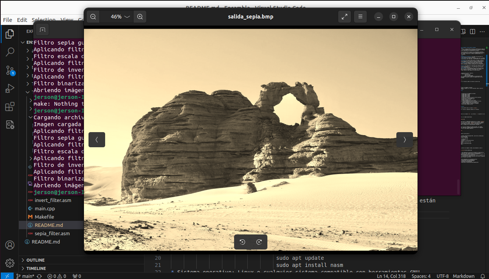
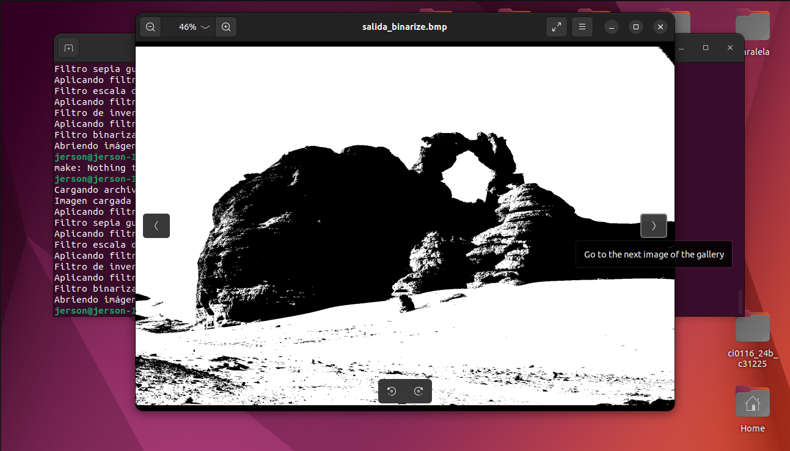
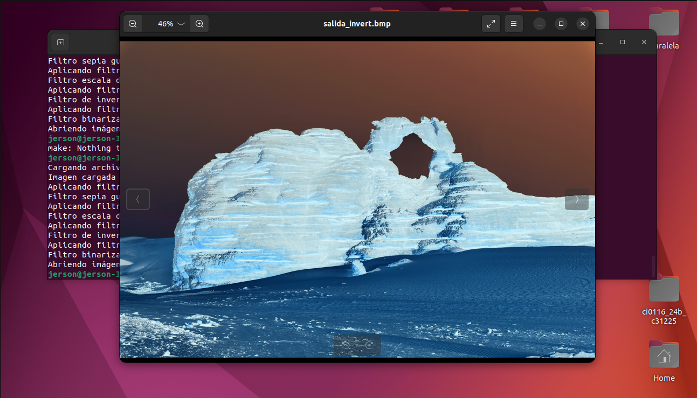

# Programming Assignment 2  
## Members: Jose Guerra (C33510) and Jerson Bonilla (C31225)

# BMP Image Filters  
This assignment applies four filters to BMP images using a combination of C++ and Assembly (ASM). It is a basic tool demonstrating how to handle BMP image files and perform image-processing operations.

## Objective of the Assignment  
The main goals of this project are to apply knowledge of SSE registers to take advantage of data-packing instructions, and to implement at least **five optimizations** to improve performance.

### Optimizations Applied  
* **Memory address loading into registers:** Addresses are loaded into SSE registers to minimize memory access.  
* **Efficient loop structure:** Loops use a decreasing counter and direct comparison (`jle .end_loop`), minimizing control operations.  
* **Direct data manipulation:** Each filter accesses and modifies the image buffer directly (`mov byte [rdi],...`), removing unnecessary intermediates.  
* **Efficient type conversion:** Instructions like `cvtsi2ss` and `cvtss2si` are used for int↔float conversion, which is more efficient in SSE than x87 FPU instructions.  
* **Register reuse:** Registers store intermediate values (B, G, R channel calculations, saturation, etc.) thanks to packed-data processing.  
* **Packed predefined constants:** Weights for grayscale, sepia, and values like 255.0 are stored packed in memory, avoiding repeated loading.

---

## Requirements  
* **C++ Compiler:** `g++` (C++17 or newer).  
* **Assembler:** `nasm`. If not installed:  
  ```bash
  sudo apt update
  sudo apt install nasm          
* Operating System: Linux or any GNU-compatible system.
* Tools to display output images:
```bash
sudo apt update
sudo apt install xdg-utils
```
* If needed:
```bash
sudo apt update
sudo apt install eog
```


Project Structure:
* Folder`entradas/`: Folder containing BMP files to process.
* Folder `salidas/`: Folder where filtered images (sepia, grayscale, invert, binarize) are saved.

### Project Structure:

```plaintext
.
├── entradas/           # Folder with test inputs
│   ├── entrada1.bmp    # Image BMP to test.
│   ├── entrada2.bmp    # Image BMP to test.
│   ├── entrada3.bmp    # Image BMP to test.
│   └── entrada4.bmp    # Image BMP to test.
├── salidas/            # Folder of the output for 4 filters applied.
├── build/              # Folder for the object files(.o).
├── bin/                # Folder for the final exec file.
├── main.cpp            # Main code in C++.
├── sepia_filter.asm    # Assembly code for sepia filter.
├── grayscale_filter.asm   # Assembly code for gray scale filter.
├── invert_filter.asm   # Assembly code for negative filter.
├── binarize_filter.asm   # Assembly code for binarize filter.
├── Makefile            # Script to compile and execute the project.
└── README.md           # Manual for use(this file).
```

### **Compilation and Execution**
1. **Preparation**

Place valid BMP images inside the  `entradas/` folder.

2. **Compilation**

```bash
make clean
make
```

The executable will be created in `bin/`. Object files will be placed in `build/`.

3. **Execution**

To apply all four filters to an image:

```bash
./bin/filtros <nombre_imagen.bmp>
```

The program will:

* Search for the image inside entradas/.

* Load it and apply all four filters.

* Save each processed image in salidas/.

* Open all generated images automatically.

#### Example
Suppose you want to use one of the included test imagges like `entrada1.bmp`. After compiling, you can run the program like this to apply filters to that image.

```bash
./bin/filtros entrada1.bmp

```

The output should be something like this:

```plaintext
jerson@jerson-IdeaPad-3-15ITL05:~/Desktop/Ensambla/TP2$ ./bin/filtros entrada1.bmp
Cargando archivo: entradas/entrada1.bmp
Imagen cargada con dimensiones: 1920x1280
Aplicando filtro sepia...
Filtro sepia guardado en salida_sepia.bmp
Aplicando filtro escala de grises...
Filtro escala de grises guardado en salida_grayscale.bmp
Aplicando filtro de inversión...
Filtro de inversión guardado en salida_invert.bmp
Aplicando filtro binarizador...
Filtro binarizador guardado en salida_binarize.bmp
Abriendo imágenes generadas...


```

Images created will be displayed in screen, something similar to this:



Images will appear in a preview window, allowing navigation using left/right arrows:







### Important Notes
* **Image format:** Only BMP images are supported. Convert PNG/JPG images before using them.
* **Limitations:** Only BMPs with a 54-byte header and 24-bit color depth are supported.
* **Error Handling:** Clear warnings are displayed if the file doesn't exist, cannot be opened, filters fail, or output images cannot be created.

# References
Sample BMP images obtained from:
* entrada1.bmp: https://filesampleshub.com/format/image/bmp
* entrada2.bmp: https://samples-files.com/sample-bmp-file/
* entrada3.bmp: https://filesamples.com/formats/bmp
* entrada4.bmp: https://people.math.sc.edu/Burkardt/data/bmp/bmp.html
